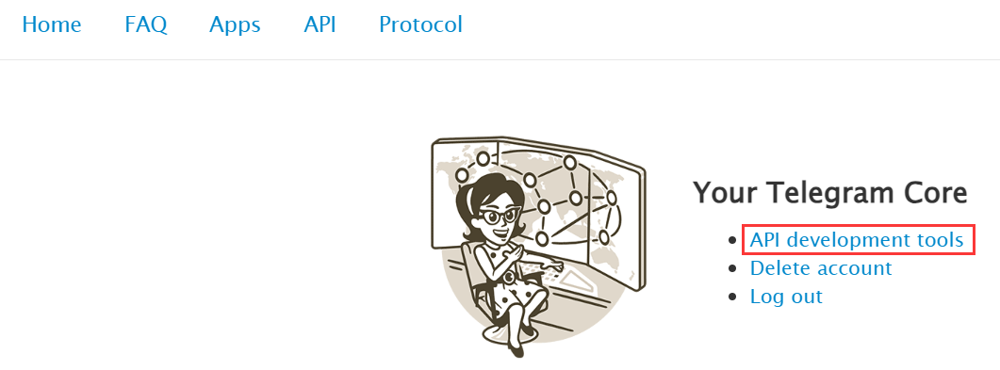
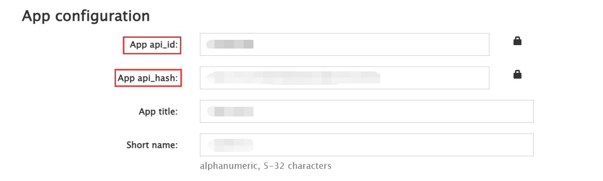
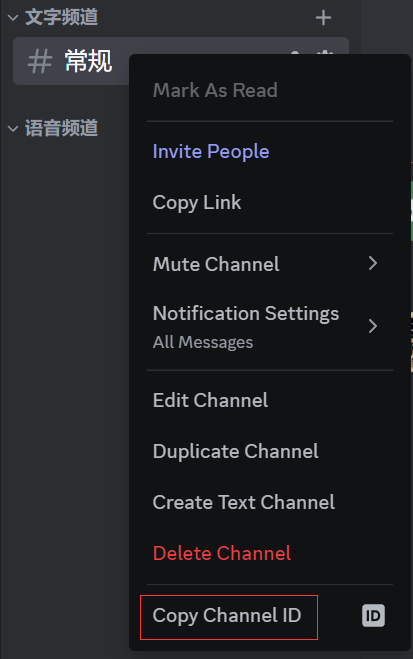
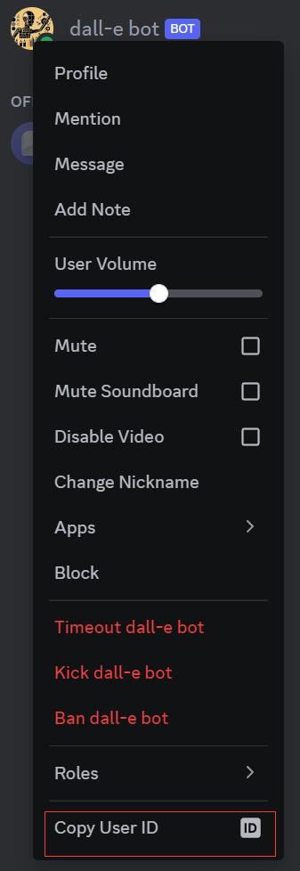

## How to configure the data/.env file

Currently there are two bot platforms which are telegram and discord can be configured.
### Telegram
> note: Remember to not break the [ToS](https://telegram.org/tos) or you will risk an account ban! [more information](https://docs.telethon.dev/en/stable/quick-references/faq.html#my-account-was-deleted-limited-when-using-the-library)
```
TELEGRAM=True   # set to True if you want to use coze-telegram bot
API_ID=23333333 # replace with your api id
API_HASH=96z7a292723306fdgb2338d2338cr6d6 # replace with your api hash
BOT_USERNAME=@dalle_bot # replace with your bot username
SESSION_NAME=whatever  # replace with your session name
TELEGRAM_GROUP_ID=-123456789 # replace with your telegram group id
```
`Telegram`: True/False, determine whether to use the telegram platform. You can ignore all envs related to telegram if you set `Telegram` to False.  

`API_ID`,`API_HASH`: Login to [telegram](https://my.telegram.org/apps),then click `API Development tools`. Fill in your application details at the new application window. There is no need to enter any URL, and only the first two fields (App title and Short name) can currently be changed later.



`BOT_USERNAME`: The bot username which you set at [botfather](https://t.me/BotFather) when you [create coze agent](./how_to_create_coze_agent.md).

`SSESSION_NAME`: You can set this env into any string, it will save telegram client session in data/${SESSION_NAME}.session when you succeed to run the project.  

`TELEGRAM_GROUP_ID`: The id of the group which contains the login telegram account and coze bot.

### Discord
> note: There is a risk of being banned, please bear the consequences yourself!!!
```
DISCORD=True   # set to True if you want to use coze-discord bot
DISCORD_AUTH=MyIxMDUzNDY3eTk5rzcuMTQxMA.G0fBkt.7z6pXlhDZcacFr36 # replace with your discord token  
DISCORD_CHANNEL_ID=1206832685596528246  # replace with your discord channel id
DISCORD_DALLE_BOT_ID=1208542007775832028    # replace with your coze-discord bot id
```
`DISCORD`: True/False, determine whether to use the discord platform. You can ignore all envs related to discord if you set `DISCORD` to False.  

~~`DISCORD_ClIENT_BOT_TOKEN`: Login to [Discord Dev](https://discord.com/developers/applications), click "New Application". After filling in the Application name, you can create a new Discord application. Switch to `Bot` tab and in the Privileged Gateway Intents section, enable three permissions (Presence Intent, Server Members Intent, Message Content Intent). Then click the `Reset Token` button and copy your token, set `DISCORD_ClIENT_BOT_TOKEN` to be this token. Also, you can switch to `OAuth2 -> URL Generator` tab, click on `bot` in SCOPES and enable related permissions(Send messages,Embed Links,Attach Files...) for the bot. Finally, copy the `GENERATED URL` below and visit the url in browser to invite your bot to your Discord server.~~(Deprecated)   

`DISCORD_AUTH`: your user token after you logining into the website of discord. 

`DISCORD_CHANNEL_ID`: For acquiring `DISCORD_CHANNEL_ID`, You should enable Developer Mode of Discord client(User Settings->Advanced->Developer Mode). Then right click on your Discord server's channel, and copy the the Channel ID.
  

`DISCORD_DALLE_BOT_ID`: For acquiring `DISCORD_DALLE_BOT_ID`, You should first publish your coze agent in Discord, see [create coze agent](./how_to_create_coze_agent.md). And In the member list of your discord server, copy the User ID of coze agent bot (Attention, not the bot when you set `DISCORD_ClIENT_BOT_TOKEN`).  



